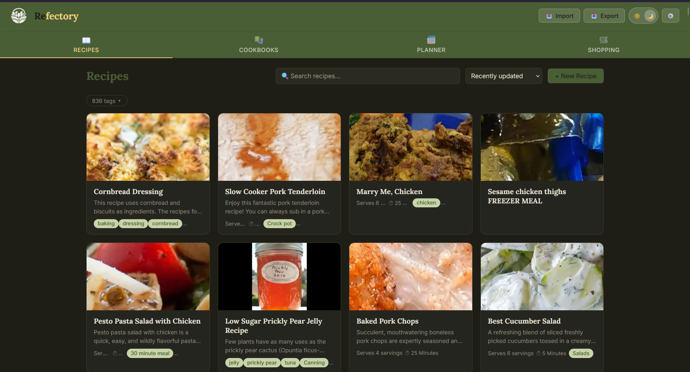

# Refectory — Recipe Keeper & Meal Planner

A personal recipe box and meal planning tool. Import recipes from Mealie backups or paste any recipe URL for automatic scraping. Organize with cookbooks, tags, and ratings. Plan your week, generate a smart shopping list, and print recipe cards that look like they came from a real recipe box. No build tools, no npm, no accounts — just static files and a Cloudflare Worker backend for image-free cross-device sync.

#### Demo:
https://badbox29.github.io/refectory/

---

#### Screenshot


---

## Features

- **Recipe URL scraper** — paste any recipe link; Refectory fetches the page through your Worker and parses JSON-LD structured data (with an Open Graph fallback) into title, ingredients, steps, times, tags, and image
- **Mealie backup import** — drag in a Mealie `.zip` backup; parses `database.json`, joins ingredient/unit/food tables, pulls images, and merges tags with categories
- **Duplicate detection on import & entry** — title-similarity matching (token overlap with a containment boost for "X" vs "X Recipe" style near-duplicates) warns when a recipe you're adding looks like one already in your library, with one-click links to the existing match — never blocks saving, just flags it
- **Manual recipe entry** — full editor with ingredient rows (amount/unit/name), numbered steps, tags, source attribution, and an embeddable image URL
- **Serving scaler** — live-recalculates ingredient quantities as you adjust the serving count, including fraction-aware string parsing for imported recipes
- **Star ratings** — 1–5 star rating per recipe, shown unrated as empty stars to invite use; sortable by top rated
- **Meal type tagging** — mark a recipe as Breakfast/Lunch/Dinner/Snack so the random suggester never proposes seafood pasta for breakfast
- **Today's Meals** — a header drawer that surfaces whatever's planned for today at a glance; hidden entirely when nothing's planned, expands into a card grid (desktop) or a focused vertical stack (mobile) showing each meal's photo, type, and title, with one tap through to the full recipe
- **Last cooked tracking** — automatically stamped when a recipe is added to the meal plan; sortable by most recently cooked
- **Personal notes per recipe** — a dedicated Notes tab on every recipe (separate from the imported description) for family reactions, substitution ideas, and tweaks — auto-saves as you type, no edit mode required
- **Tag filtering** — collapsible tag panel with search, so libraries with hundreds of tags stay navigable
- **Tag merge tool** — a dedicated manager listing every tag with its recipe count; search, multi-select, and merge any number of near-duplicate tags ("Mediterranean chicken salad" / "mediterranean chicken salad") into one canonical name across the whole library in a single pass, with a select-all for the currently filtered results
- **Bulk tag editing** — toggle select mode on the recipe grid, multi-select any combination of recipes (optionally narrowed by a search first), and add or remove a tag across the entire selection at once; bulk-add to a cookbook and bulk delete/export are available from the same action bar
- **Ingredient-aware search** — search matches ingredient list contents in addition to title, description, and tags, so "chicken spinach" surfaces any recipe containing both as ingredients even if neither word appears in the title; a match-source pill on each result shows whether it hit on title, description, tags, or ingredients
- **Cookbooks** — curated recipe collections separate from tags, each with a thumbnail mosaic of its contents
- **Weekly meal planner** — drag-free slot-based planning across Breakfast/Lunch/Dinner/Snack for all seven days, with a single-day mobile view on narrow screens
- **Random recipe suggestion** — 🎲 button fills an empty slot with a recipe matching that slot's meal type, falling back to untyped or any recipe if no match exists, and avoiding repeats already planned that week
- **Smart shopping list** — aggregates ingredients across the next two weeks of planned meals, merges matching quantities and units (handles unicode fractions, abbreviation variants, and prep-descriptor differences), and lists multiple source recipes per item
- **Multiple shopping lists with store assignment** — create named lists (e.g. "Costco," "Farmer's Market") and assign any item — recipe-derived or manual — to one with a tap; everything still lives in one underlying list, so nothing needs to be re-entered, it's just sorted into tabs. Stays invisible (no tabs shown) until you create your first custom list
- **Manual shopping items** — add anything not generated from a recipe; check off and clear independently
- **Recipe printing** — single-page, recipe-box-style print layout (or Save as PDF) with ingredients, numbered steps, timing, and personal notes
- **Shopping list printing** — dedicated print stylesheet for the smart-merged list; pick one list or several, each renders as its own clean two-column checklist page with a store-assignment pill per item
- **Image storage via IndexedDB** — recipe photos never touch `localStorage` or the Worker; they live in the browser's IndexedDB so large imports never hit a storage quota
- **Full backup & restore** — export a `.zip` with recipe data and images for a full portable backup, or export images-only to carry photos to a second synced device
- **Dark mode** — full light/dark theme toggle; header and navigation stay a constant deep green in both modes
- **Mobile responsive** — tested breakpoints for tablets, mid-size phones, and folding phones (closed and open)
- **Cross-device sync** — token-based KV sync via Cloudflare Worker, with an optional one-way upgrade path from token to Google sign-in

---

## File Structure

```
refectory/
├── index.html          # App entry point
├── css/
│   └── styles.css      # All styles
├── js/
│   ├── app.js           # All client-side logic
│   ├── auth.js          # Portable auth module (guest / token / Google)
│   └── imageStore.js    # IndexedDB wrapper for recipe images
├── logo.png             # App icon
├── worker.js             # Cloudflare Worker (deploy separately)
└── README.md
```

---

## Setup

### 1. Get the files

Clone or download this repository. The app is entirely static — `index.html`, `css/styles.css`, and the three files in `js/` are all you need to run it.

Open `index.html` directly in a browser for local use, or host it on GitHub Pages (or any static host) for a permanent URL.

---

### 2. Deploy the Cloudflare Worker

The Worker proxies recipe URL fetches (bypassing browser CORS restrictions), serves the Google Sign-In client ID without exposing it in frontend source, and provides the KV storage backend for cross-device sync.

A free Cloudflare account is sufficient for personal use.

#### 2a. Create the Worker

1. Log in to [dash.cloudflare.com](https://dash.cloudflare.com) and open **Workers & Pages**.
2. Click **Create** → **Create Worker**.
3. Give it a name (e.g. `refectory-worker`) and click **Deploy**.
4. Click **Edit code**, paste the entire contents of `worker.js` into the editor, and click **Deploy** again.
5. Note your worker URL — it will look like `https://your-worker-name.your-subdomain.workers.dev`.

#### 2b. Create a KV namespace

1. In the Cloudflare dashboard, go to **Workers & Pages → KV**.
2. Click **Create a namespace**, name it (e.g. `refectory-kv`), and click **Add**.
3. Go back to your Worker → **Settings → Bindings**.
4. Click **Add** → **KV Namespace**.
5. Set the **Variable name** to exactly `REFECTORY_KV` and select the namespace you just created.
6. Click **Deploy** to save the binding.

> **Why `REFECTORY_KV`?** The worker references `env.REFECTORY_KV` by that exact name. A different variable name will break all storage routes.

#### 2c. Set environment variables

In your Worker → **Settings → Variables and Secrets**, add the following:

| Variable | Type | Value |
|---|---|---|
| `GOOGLE_CLIENT_ID` | Text | Your Google OAuth Client ID (only needed if you want Google sign-in) |

> The Google Client ID lives exclusively in the Worker and is served to the frontend via `/auth/config` at boot. It is never hardcoded in any client-side file.

#### 2d. Point the app at your Worker

1. Open the app in your browser.
2. On first launch, choose **Start fresh** (or **Load existing account** if migrating from another device).
3. Enter your Worker URL when prompted during account setup.

The app will immediately begin routing sync and recipe-scraping requests through your Worker.

---

### 3. Cross-Device Sync

Your sync token is your identity in KV. It's generated automatically on first load for guest and token accounts.

- On your **primary browser**: open Settings, copy your **Sync Token**, and save it somewhere safe.
- On a **new browser or device**: during account setup choose **Load existing account → Continue with token**, enter your Worker URL and paste your token. Both browsers now share the same recipe data.

Recipe data, meal plans, and cookbooks sync automatically once a Worker URL and token are set. **Images do not sync** — they're stored locally in IndexedDB on each device. Use the **Export → Images Only** option to carry photos to a second device (see Image Storage below).

---

### 4. Google Sign-In (Optional)

Token accounts can be upgraded to Google sign-in for a friendlier identity than a random string.

1. Open Settings and click **Upgrade to Google sign-in**.
2. Sign in with the Google account you want to link.
3. This is a **one-way, permanent change** — your old token stops working immediately after migration, and the same Google account cannot be linked to more than one Refectory account.
4. Other devices still signed in with the old token will be prompted to sign in with Google on their next refresh.

---

## Worker Routes Reference

| Method | Route | Description |
|---|---|---|
| `GET` | `/auth/config` | Returns the Google Client ID for sign-in (public, no auth) |
| `POST` | `/auth/google` | Verify a Google ID token |
| `POST` | `/auth/verify` | Re-verify a stored Google credential at boot |
| `POST` | `/auth/migrate` | One-way token → Google account migration (HMAC-authenticated) |
| `GET` | `/storage/:token/:key` | Read a KV value |
| `PUT` | `/storage/:token/:key` | Write a KV value |
| `DELETE` | `/storage/:token/:key` | Delete a KV value |
| `GET` | `/scrape?url=` | Server-side fetch of a recipe page for client-side parsing (rate-limited) |
| `GET` | `/ping` | Health check (no auth required) |

---

## Data Storage

Recipe data, meal plans, cookbooks, and account preferences are stored in Cloudflare KV under your user token (or Google-linked key). Nothing is stored server-side beyond what you explicitly save.

`localStorage` holds a local copy of all recipe data **except images** — it's the fallback when the Worker is unreachable and the source for instant page loads. **Recipe images are stored exclusively in the browser's IndexedDB**, never in `localStorage` and never pushed to the Worker. This keeps large recipe collections with full photo libraries well under any storage quota, but means images must be exported/imported separately when moving to a new device (see Setup → Cross-Device Sync).

---

## API Keys & External Services

| Service | Used For | Key Required | Notes |
|---|---|---|---|
| Google Identity Services | Optional sign-in upgrade from token accounts | Yes (Client ID only) | Client ID served from the Worker, never in frontend source |
| Recipe source websites | URL scraping | No | Fetched server-side via the Worker to bypass browser CORS |
| JSZip (CDN) | Mealie backup parsing, full backup export/import | No | Loaded from cdnjs, runs entirely client-side |

---

## Recipe Import Reference

When importing a Mealie backup `.zip`, the following mapping is applied:

| Mealie | Refectory |
|---|---|
| `recipes.name` | `title` |
| `recipes.description` + `notes` | `description` (notes appended with a bold heading) |
| `recipes_ingredients` (joined to units/foods) | `ingredients[]` |
| `recipe_instructions` | `steps[]` |
| `tags` + `categories` | `tags[]` (merged, deduplicated) |
| `recipes.org_url` | `source` / `sourceUrl` |
| `prep_time`, `cook_time`, `total_time`, `recipe_yield` | timing fields + servings |
| `data/recipes/{uuid}/images/tiny-original.webp` | `image` (stored in IndexedDB) |

URL-scraped recipes follow the same target schema, populated from a page's JSON-LD `Recipe` structured data where available.

---

## License

See LICENSE file.
