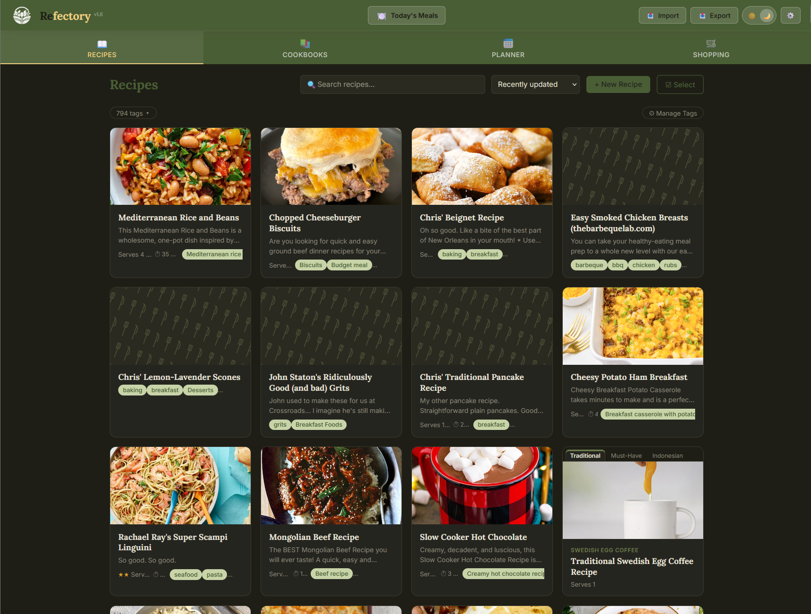

# Refectory — Recipe Keeper & Meal Planner

A personal recipe box and meal planner, built for people who actually cook. Bring recipes in from a Mealie backup, paste a URL, or paste plain text from a message. Organize them with tags, cookbooks, ratings, and groups. Plan the week, generate a shopping list that merges duplicate ingredients properly, share the plan with your family, and print recipe cards that look like they came from a real recipe box.

No build tools, no npm, no framework. Just static files and a Cloudflare Worker for sync.

#### Demo:
https://badbox29.github.io/refectory/

---

#### Screenshot


---

## Features

### Getting recipes in

- **URL scraper** — paste any recipe link and Refectory fetches it through your Worker, parsing JSON-LD structured data into title, ingredients, steps, times, tags, and image
- **Heuristic fallback for pages with no recipe data** — plenty of food blogs never mark up their recipes properly. When there's no JSON-LD to find, Refectory reads the page body directly, looking for "Ingredients" and "Directions" headings and the lists that follow. It's a best guess by nature, so results are flagged and land in the editor for you to check rather than saving silently
- **Multi-recipe pages** — when a page contains several recipes (a post comparing three takes on the same drink, say), you get a picker showing each one's ingredient and step counts. Take one, or send them all to a **tabbed review queue** where each gets its own tab in the editor — save the ones you want, discard the rest, and edits survive switching between tabs
- **Paste recipe text** — for anything that arrives as text: a message from a friend, something copied out of a PDF, a transcription. Splits on Ingredients/Directions headings, strips bullets and numbering, and pulls out lines like "Total cook time: 5–6 hours" into the right fields instead of leaving them as a phantom final step
- **Mealie import** — drag in a Mealie `.zip` backup and it parses `database.json`: recipes, ingredients joined to units and foods, instructions, tags merged with categories, images, **meal plan history, star ratings, family favorites, and nutrition data**. Or paste raw recipe JSON, or connect to a live Mealie instance with a URL and API key
- **Bot-block handling** — some recipe sites actively refuse automated fetches. Refectory now tells you that's what happened, rather than reporting a generic failure and sending you hunting for a bug that doesn't exist. The Worker sends realistic browser headers and can fall back to a real headless browser via Cloudflare Browser Run
- **Manual entry** — full editor with ingredient rows, numbered steps, tags, source attribution, and an image URL
- **Duplicate detection on entry** — title-similarity matching warns when a recipe you're adding looks like one you already have, with one-click links to the match. Never blocks saving, just flags it

### Organizing

- **Recipe groups** — three variations on the same dish shouldn't eat three cards in your grid. Select them, hit Group, and they collapse into a single card with tabs along the top edge. Refectory suggests the group name and tab labels by finding what the titles share — "Traditional Swedish Egg Coffee Recipe" and friends become **Swedish Egg Coffee** with tabs reading *Traditional*, *Must-Have*, and *Indonesian*. All editable. Searching inside a group opens the matching tab, and ungrouping keeps every recipe
- **Duplicate merging** — imported the same library twice? The dedupe tool finds recipes sharing a name, shows you what it would remove before touching anything, keeps whichever copy has the most to lose (image, cook history, rating, favorite), and carries over anything the other copy had. Meal plans, cookbooks, and templates are all repointed at the survivor first, so nothing ends up referencing a recipe that no longer exists
- **Family Favorites** — a simple yes/no flag for the meals your household actually eats, separate from your own star rating. Toggle it from the recipe card or the editor, and sort by it
- **Star ratings** — 1–5 per recipe, shown unrated as empty stars to invite use
- **Sorting** — recently updated, recently *added* (by creation date, so planning a week doesn't bury the recipe you added this morning), A→Z, top rated, family favorites, and recently cooked
- **Cookbooks** — curated collections separate from tags, each with a thumbnail mosaic
- **Tag filtering** — collapsible panel with search, so a library with hundreds of tags stays navigable
- **Tag merge tool** — lists every tag with its recipe count; search, multi-select, and merge near-duplicates into one canonical name across the whole library in a single pass
- **Bulk editing** — select any number of recipes and add or remove a tag, add to a cookbook, group, export, or delete from one action bar
- **Ingredient-aware search** — "chicken spinach" finds recipes containing both as ingredients even if neither word is in the title. A match-source pill flags hits on ingredients, description, or tags
- **Personal notes** — a Notes tab on every recipe, separate from the imported description, for family reactions and substitutions. Auto-saves as you type
- **Serving scaler** — live-recalculates quantities as you change the serving count, fraction-aware

### Planning

- **Weekly planner** — slot-based across Breakfast/Lunch/Dinner/Snack for all seven days, with a single-day view on narrow screens and today's column highlighted so it stays findable while scrolling
- **More than one meal in a slot** — cooking two dinners on a good day so there's something in the freezer for a bad one is a plan, not a mistake. Slots hold as many dishes as you need; they stack as compact rows and each can be removed on its own
- **Meal plan templates** — save a week, a month, or a custom date range under a name, then load it onto any future week. Templates anchor on week index and day of week rather than dates, so Taco Tuesday lands on Tuesday no matter what shape the target month is. Load replaces or fills only empty slots, and warns before overwriting anything
- **Leftovers & fend-for-yourselves nights** — mark a slot as leftovers of a specific recipe, or as no planned meal at all. The leftovers picker looks back from *the day you're planning*, not today, so it works when you're planning a month ahead. Same-day meals count if they come earlier in the day — turkey at lunch is fair game for dinner, but not the reverse — and snacks count all day. Neither adds anything to the shopping list, and leftovers don't re-stamp the original cook date
- **Random suggestion** — 🎲 fills a slot with a recipe matching that meal type, avoiding repeats already planned that week
- **Today's Meals** — a header drawer showing what's planned today, hidden entirely when nothing is
- **Last cooked tracking** — stamped automatically when a recipe is planned, and derived from real dates when importing plan history rather than marking everything as cooked today

### Sharing & shopping

- **Share a meal plan** — creates a link anyone can open, no account needed. Shows each meal's photo, name, and short description — **but never the ingredients**, which is deliberate: telling a kid that the dinner they've happily eaten for years contains soy sauce is a good way to stop them eating it. The link reflects changes you make to the plan and expires on its own at the end of the range it covers
- **Smart shopping list** — aggregates ingredients across the next two weeks, merging matching quantities and units (unicode fractions, abbreviation variants, prep-descriptor differences) and listing every source recipe per item
- **Multiple lists with store assignment** — create named lists ("Costco", "Farmer's Market") and assign any item to one with a tap. Everything still lives in one underlying list, just sorted into tabs. Stays invisible until you make your first custom list
- **Manual items** — add anything not from a recipe; check off and clear independently
- **Printing** — recipe-box-style single-page recipe cards, and a dedicated print layout for the shopping list with a store pill per item

### Under the hood

- **Two-tier image storage** — image *links* live on the recipe and sync everywhere. Image *files* (from Mealie backups) stay in the browser's IndexedDB, so large imports never hit a storage quota. Local files win at display time, so syncing can never downgrade a photo you already have
- **Re-pull images** — refetches missing images from each recipe's source URL in bulk, four at a time, with live progress, a cancel button, and a per-recipe log that separates genuine failures from sites blocking automated access. Recovered links write to the recipe, so one repair run propagates to every device
- **Secure image links** — prefers a page's `og:image:secure_url` and upgrades bare `http://` links, so shared pages and cards don't trip mixed-content warnings
- **Storage failure banner** — browsers cap storage per web address, shared across every page hosted there. If a write fails, Refectory says so in a banner that stays put, tells you how much of the limit it's using versus everything else, and offers an export. It used to be a three-second toast, which is how an unnoticed quota problem quietly discards an afternoon of edits
- **Import safety** — imports won't run until sync has finished loading, because importing against a half-loaded library is how you end up with two copies of everything. Mealie imports also store the source recipe ID, so a re-import updates in place rather than duplicating by name
- **In-app dialogs** — confirmations are styled like the rest of the app rather than the browser's own alert boxes, which means destructive actions can be labelled properly and a dialog handing you an account token can make it selectable
- **Full backup & restore** — export a `.zip` with recipe data and image files, or images-only to carry photos to a second device
- **Dark mode** — full light/dark toggle
- **Mobile responsive** — breakpoints at 860px, 640px, and 420px, covering tablets, phones, and folding phones open and closed
- **Cross-device sync** — token-based KV sync via Cloudflare Worker, with an optional one-way upgrade to Google sign-in

---

## File Structure

```
refectory/
├── index.html          # App entry point
├── css/
│   └── styles.css      # All styles
├── js/
│   ├── app.js           # All client-side logic
│   ├── auth.js          # Portable auth module (guest / token / Google)
│   └── imageStore.js    # IndexedDB wrapper for recipe images
├── logo.png             # App icon
├── worker.js            # Cloudflare Worker (deploy separately)
└── README.md
```

---

## Setup

### 1. Get the files

Clone or download this repository. The app is entirely static — `index.html`, `css/styles.css`, and the three files in `js/` are all you need.

Open `index.html` directly in a browser for local use, or host it on GitHub Pages (or any static host) for a permanent URL.

> **One thing worth knowing about hosting:** browsers cap local storage *per web address*, not per app. If you host several apps under one GitHub Pages account, they all share one quota — and a big one can starve the others. A custom domain or subdomain per app gives each its own. Refectory will warn you loudly if writes start failing, but it can't fix a neighbour's storage use.

---

### 2. Deploy the Cloudflare Worker

The Worker proxies recipe URL fetches (bypassing browser CORS), serves the Google Sign-In client ID without exposing it in frontend source, renders shared meal plan pages, and provides the KV storage backend for sync.

A free Cloudflare account is enough for personal use. One optional feature — the headless-browser fallback for sites that block scrapers — needs the Workers Paid plan.

#### 2a. Create the Worker

1. Log in to [dash.cloudflare.com](https://dash.cloudflare.com) and open **Workers & Pages**.
2. Click **Create** → **Create Worker**.
3. Give it a name (e.g. `refectory-worker`) and click **Deploy**.
4. Click **Edit code**, paste the entire contents of `worker.js`, and click **Deploy** again.
5. Note your worker URL — it'll look like `https://your-worker-name.your-subdomain.workers.dev`.

#### 2b. Create a KV namespace

1. Go to **Workers & Pages → KV**.
2. Click **Create a namespace**, name it (e.g. `refectory-kv`), and click **Add**.
3. Back in your Worker → **Settings → Bindings**.
4. Click **Add** → **KV Namespace**.
5. Set the **Variable name** to exactly `REFECTORY_KV` and pick the namespace you just made.
6. Click **Deploy** to save the binding.

> **Why `REFECTORY_KV`?** The worker references `env.REFECTORY_KV` by that exact name. A different variable name breaks every storage route.

#### 2c. Set environment variables

In your Worker → **Settings → Variables and Secrets**:

| Variable | Type | Value |
|---|---|---|
| `GOOGLE_CLIENT_ID` | Text | Your Google OAuth Client ID (only needed for Google sign-in) |
| `ALLOWED_ORIGINS` | Text | Comma-separated list of addresses allowed to call the Worker, e.g. `https://you.github.io` |

> The Google Client ID lives only in the Worker and reaches the frontend via `/auth/config` at boot. It's never hardcoded in a client-side file.

> `ALLOWED_ORIGINS` matters if you ever move the app to a new address — every sync request will fail until the new one is listed. The shared meal plan page is deliberately exempt, since a link opened from a text message sends no origin at all.

#### 2d. Browser Run fallback (optional, Workers Paid)

Some recipe sites block automated fetches outright. The Worker can fall back to a real headless browser for those.

1. Worker → **Settings → Bindings** → **Add** → **Browser Rendering**.
2. Set the variable name to exactly `BROWSER`.
3. Make sure the Worker's **compatibility date** is `2026-03-24` or later.
4. **Deploy** — bindings only take effect on a fresh deployment.

Without this binding everything still works; you just get an honest "this site blocks automated access" message instead of a fallback attempt. Worth trying the plain fetch first — realistic browser headers alone clear most sites, and browser time is metered.

> It won't clear everything. Some publishers block by IP reputation, and a Worker calling out from Cloudflare's network can look *more* suspicious, not less. Those recipes go in by hand.

#### 2e. Point the app at your Worker

1. Open the app.
2. On first launch, choose **Start fresh** (or **Load existing account** if you're migrating).
3. Enter your Worker URL when prompted.

---

### 3. Cross-Device Sync

Your sync token is your identity in KV, generated automatically on first load.

- On your **primary browser**: open Settings, copy your **Sync Token**, and keep it somewhere safe. It's the only way back to your data.
- On a **new browser or device**: during setup choose **Load existing account → Continue with token**, enter your Worker URL, and paste the token.

Recipes, meal plans, cookbooks, templates, groups, and image *links* all sync automatically.

Image **files** don't — they live in IndexedDB on each device. This only affects recipes imported from a Mealie backup, since those arrive as actual files. Anything scraped or entered by hand stores a link, and links travel with everything else.

Two ways to close that gap on a new device:

- **Import → Re-pull Images** refetches from each recipe's source URL and writes results to the recipe, so the repair syncs everywhere. Fastest, needs no files, but only helps recipes that have a source URL — and old links do rot.
- **Export → Images Only** produces a `.zip` of this device's image files to import elsewhere. Slower and manual, but exact.

---

### 4. Google Sign-In (Optional)

Token accounts can upgrade to Google sign-in for a friendlier identity than a random string.

1. Settings → **Upgrade to Google sign-in**.
2. Sign in with the Google account you want to link.
3. This is **one-way and permanent** — the old token stops working immediately, and one Google account can only be linked to one Refectory account.
4. Other devices on the old token will be prompted to sign in with Google on their next refresh.

> If the Google account already has a Refectory account, upgrade will refuse — which is correct, since merging two accounts isn't something it can do safely. Use **Switch / Create Account → load my existing account** and sign in with Google instead.

---

## Worker Routes Reference

| Method | Route | Description |
|---|---|---|
| `GET` | `/auth/config` | Returns the Google Client ID for sign-in (public, no auth) |
| `POST` | `/auth/google` | Verify a Google ID token |
| `POST` | `/auth/verify` | Re-verify a stored Google credential at boot |
| `POST` | `/auth/migrate` | One-way token → Google migration (HMAC-authenticated) |
| `GET` | `/storage/:token/:key` | Read a KV value |
| `PUT` | `/storage/:token/:key` | Write a KV value |
| `DELETE` | `/storage/:token/:key` | Delete a KV value |
| `POST` | `/share` | Create a self-expiring meal plan link (authenticated) |
| `GET` | `/share/:id` | Public meal plan page — no auth, no origin check |
| `GET` | `/scrape?url=` | Server-side fetch of a recipe page (rate-limited, browser fallback) |
| `GET` | `/ping` | Health check (no auth) |

---

## Data Storage

Recipes, meal plans, cookbooks, templates, groups, and preferences live in Cloudflare KV under your user token. Nothing is stored server-side beyond what you save.

`localStorage` holds a local copy — the fallback when the Worker is unreachable, and the source of instant page loads.

Images split across two stores:

| | Where it lives | Syncs? |
|---|---|---|
| Image **link** (URL imports, manual entry, re-pull results) | On the recipe record | Yes |
| Image **file** (Mealie imports, pasted data URLs) | Browser IndexedDB only | No |

A link is about a hundred bytes, so it costs nothing to carry through KV. A file is kilobytes and would blow past the `localStorage` quota and bloat every sync. At display time a local file always beats a link, so a synced link can never replace a photo you already hold.

Shared meal plan links are stored separately under a random ID with an expiry timestamp, and Cloudflare removes them automatically once the range they cover has passed.

---

## API Keys & External Services

| Service | Used For | Key Required | Notes |
|---|---|---|---|
| Google Identity Services | Optional sign-in upgrade | Yes (Client ID only) | Served from the Worker, never in frontend source |
| Recipe source websites | URL scraping | No | Fetched server-side to bypass browser CORS |
| Cloudflare Browser Run | Fallback for sites blocking scrapers | No (binding only) | Optional; Workers Paid plan, metered by browser time |
| JSZip (CDN) | Backup parsing and export | No | Loaded from cdnjs, runs entirely client-side |

---

## Recipe Import Reference

Importing a Mealie backup `.zip` applies this mapping:

| Mealie | Refectory |
|---|---|
| `recipes.name` | `title` |
| `recipes.id` | `sourceId` (so re-imports update in place) |
| `recipes.description` + `notes` | `description` (notes appended with a bold heading) |
| `recipes_ingredients` (joined to units/foods) | `ingredients[]` |
| `recipe_instructions` | `steps[]` |
| `tags` + `categories` | `tags[]` (merged, deduplicated) |
| `recipes.org_url` | `source` / `sourceUrl` |
| `recipes.rating` | `rating` |
| `users_to_favorites` | `favorite` (union across the household) |
| `recipe_nutrition` | `nutrition` (numeric fields only) |
| `recipes.created_at` | `createdAt` (so "recently added" reflects real history) |
| `group_meal_plans` | meal plan entries, mapped to ISO week + weekday |
| `prep_time`, `cook_time`, `total_time`, `recipe_yield` | timing fields + servings |
| `data/recipes/{uuid}/images/tiny-original.webp` | image file (IndexedDB) |

Meal plan import notes worth knowing: Mealie allows several dishes on the same date and meal type, and Refectory keeps all of them rather than dropping any. `side` entries map to the snack slot. Dates are parsed as local calendar days, not UTC, so nothing shifts a day. `lastCooked` comes from the real plan dates and never from the moment of import, and future entries don't count as cooked. Re-running the import produces the same result rather than doubling everything.

URL-scraped recipes follow the same target schema from JSON-LD `Recipe` data where available, falling back to a heuristic read of the page body, then to Open Graph tags for title and image alone. The **Re-pull Images** tab reuses this extraction path against a recipe's stored source URL.

---

## License

See LICENSE file.
